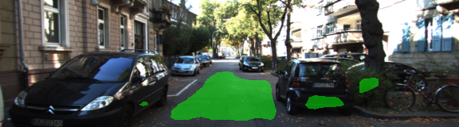
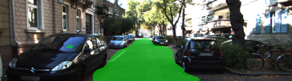
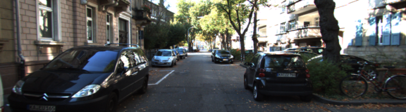
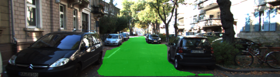
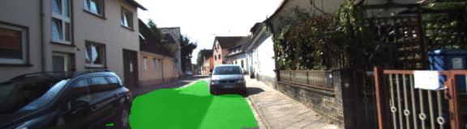
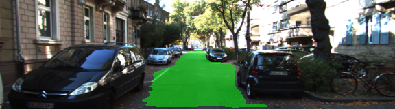
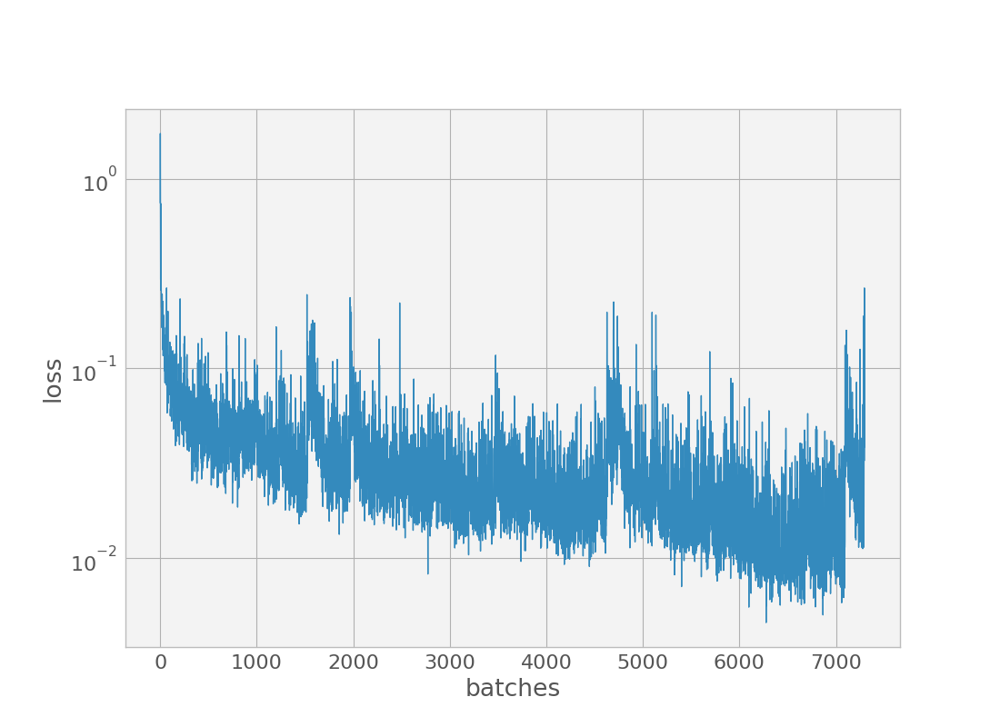
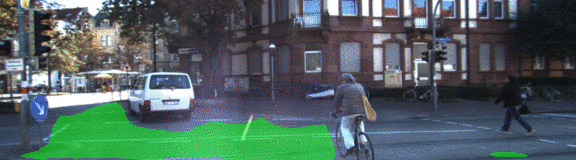

# Semantic Segmentation
## Introduction
In this project, you'll label the pixels of a road in images using a Fully Convolutional Network (FCN).

Additionally short videos 
[here](https://youtu.be/GdW_vgUg1YA),
[here](https://youtu.be/cZv4Ccd8I8M),
[here](https://youtu.be/0fpr8EizK7Y),
and
[here](https://youtu.be/Uw1aytYEH6E).

### Submission
☒ Ensure you've passed all the unit tests.

☒ Ensure you pass all points on [the rubric](https://review.udacity.com/#!/rubrics/989/view).

☐ Submit the following in a zip file.
 - `helper.py`
 - `main.py`
 - `project_tests.py`
 - Newest inference images from `runs` folder  (**all images from the most recent run**)
 
### Tips
- The link for the frozen `VGG16` model is hardcoded into `helper.py`.  The model can be found [here](https://s3-us-west-1.amazonaws.com/udacity-selfdrivingcar/vgg.zip)
- The model is not vanilla `VGG16`, but a fully convolutional version, which already contains the 1x1 convolutions to replace the fully connected layers. Please see this [forum post](https://discussions.udacity.com/t/here-is-some-advice-and-clarifications-about-the-semantic-segmentation-project/403100/8?u=subodh.malgonde) for more information.  A summary of additional points, follow. 
- The original FCN-8s was trained in stages. The authors later uploaded a version that was trained all at once to their GitHub repo.  The version in the GitHub repo has one important difference: The outputs of pooling layers 3 and 4 are scaled before they are fed into the 1x1 convolutions.  As a result, some students have found that the model learns much better with the scaling layers included. The model may not converge substantially faster, but may reach a higher IoU and accuracy. 
- When adding l2-regularization, setting a regularizer in the arguments of the `tf.layers` is not enough. Regularization loss terms must be manually added to your loss function. otherwise regularization is not implemented.

## Development History

##### 1. Add first draft FCN decoder.

##### 2. First working draft--use SAME padding in upsample.

##### 3. Save a diagram of the graph to a PDF.
")

Requires tfgraphviz:
https://github.com/akimach/tfgraphviz

[//]: # (##### 4. Finally ignore that dumb tensorflow warning.)

##### 5. Initialize upsampling as bilinear interpolation.

##### 6. Regularize bilinear weights also.

##### 7. Use a smaller L2 regularizer.

##### 8. Switch to `tf.nn.sigmoid_cross_entropy_with_logits`.

Try training to 3 classes.    
Muuuuch slower.

##### 9. 3aa7c99 Switch to `tf.nn.softmax_cross_entropy_with_logits_v2`.

##### 10. 83546ec Return to 2 classes.

##### 11. e43d867 Zero-initialize skip connection 1x1 weights.

##### 12. 4c24ced 1e-4 L2 for skip conn.s; reduce_mean for loss.

##### 13. Add another 1x1 middle layer.

##### 14. Check traning results as well as testing.

##### 15. 96a2f82 Look for foreground, not not background.

##### 16. c92c873 Scale down higher res skips more.

##### 17. Remove pointless extra linear conv1x1.

##### 18. d5420cf Increase LR for small batches.

##### 19. ce62d6c Actually, use a smaller LR.

##### 20. Use flip, rotate, shift, and noise augmentation.

##### 21. Infer on video also.

##### 22. fe5e2e7 Use 'nearest' extension for rotate/shift augmentation.

##### 23. e125e2c Fix video output.

##### 24. 681d02c Copy losshist.png to main dir.

##### 25. Add second video folder.

##### 27. Make a bunch of videos.

