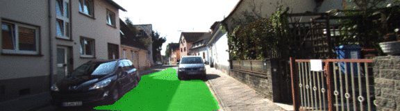

# Semantic Segmentation
## Introduction
In this project, I label the pixels of a road in images using a Fully Convolutional Network (FCN) [1].
(Click animated GIFs for Youtube versions.)

## Submission
☒ Ensure you've passed all the unit tests.

☒ Ensure you pass all points on [the rubric](https://review.udacity.com/#!/rubrics/989/view).

☐ Submit the following in a zip file.
 - `helper.py`
 - `main.py`
 - `project_tests.py`
 - Newest inference images from `runs` folder  (**all images from the most recent run**)
 
## Training Data

The dataset contains images with filenames of the form `*_lane_*` and `*_road_*` -- the former mark just the ego-lane in which the viewpoing car is traveling, while the latter mark the whole drivable surface of the road.

To simplify the problem, I used only data of the second form.

Additionally, some parts of the dataset split the GT image into three classes rather than two, being the lane or road on our side of a highway divider, the road on the other side, and other non-road features. At one point, I briefly tried to train such a three-class segmenter, but stopped quickly due to the large increase in trainable parameters and poor initial training results. After this, I merged the opposing-traffic class and the offroad-class into one.

## Network Architecture

The architecture for this project follows Long et al. [1].

")

In summary, we remove the fully-connected classifier portion from a pre-trained VGG16 network, take three intermediate feature-map layers from the network of differing sizes (in width, height, and number of channels), and combine these, upscaling as appropriate. Upscaling is performed as a so-called transposed convolution, also know as a fractionally-strided convolution or a deconvolution. Combination is performed with addition, but, per [1], this is equivalent to concatenation of features via the linearity of the convolutions--no ReLU or other nonlinearities are added in this post-VGG16 "decoder" section of the network.

The deconvolutions serve to align the feature maps from multiple scales in width and height. However, before combining features by addition, we use a 1x1 convolution to produce our target number-of-features as a linear combination of the 256 or 512 features provided by two different layers of VGG16. This is equivalent to using a fully-connected layer pointwise across the respective feature maps, but ensures that there are no fixed-size layers in the entire network (the network is "fully convolutional"), and the output will always have the same width and height as the input image, allowing us to apply it to images of arbitrary size (above a certain minimum).

The combination of information from multiply-scaled feature maps is called a "skip connection", in reference to the structure of the figure above. Again, per [1], these skip connections are initialized with an all-zeros 1x1 convolution weight matrix. That is, at start of training, only information from the coarsest level of the VGG16 encoder reaches the output. Additionally, features from higher-resolution layers in the encoder are multiplied by progressively smaller scaling factors before combining with lower-resolution features, to prevent the higher from dominating the lower.

The upscaling deconvolutions were initialized as bilinear interpolation, though they were permitted to vary during training.

All of these small details, suggested by the Long paper, did not visually add to or detract from the quality of the resulting videos (except for the bilinear interpolation initialization, which helped considerably over Glorot/Xavier initialization). However, one addition that made a really big difference was data augmentation. To help with generalization, I supplemented the training dataset with image inputs corrupted with random horizontal flips, small rotations, small translations, and salt-and-pepper noise (some pixels randomly set to black or white).

Before data agumentation:

After data augmentation:

Besides data augmentation, the only other thing that seemed to provide major improvements in visual quality was long training at a moderate to low learning rate. However, I additionally tried several other tricks, with some small improvement possibly attributed to each. Namely: (1) First, I trained the whole network (VGG16 layers and the new decoder layers), then I restricted the second half of the training to only the decoder layers, using the `var_list` argument to Tensorflow's `AdamOptimizer.minimize` method. (2) I used a learning-rate decay schedule (annealing), where the learning rate decayed exponentially over up to two orders of magnitude during about an hour and a half of training.

## Results

For the most part, the network is able to identify drivable space fairly well.

However, it still has trouble with very high-contrast and sharp shadow edges

and also scenes where I as a human am confused about where exactly to draw the road edge (and so where the human labelers may have been inconsistent as well)

My next step will be to gather a similar dataset from the point of view of an RC car driving around an office, retrain on this network, and then used this to identify drivable space for a path planner, in a manner similar to the LAGR rover [2,3] developed by Yann LeCun and colleagues at NYU in the previous decade, though I'll have Ackermann kinematics rather than differential drive.

## References

[1] J. Long, E. Shelhamer, and T. Darrell, "Fully convolutional networks for semantic segmentation,"" in Proceedings of the IEEE Computer Society Conference on Computer Vision and Pattern Recognition, 2015, vol. 07-12-June-2015.

[2] ["LAGR: Learning Applied to Ground Robotics"](https://cs.nyu.edu/~yann/research/lagr/#videos)

[3] R. Hadsell et al., ["Online Learning for Offroad Robots: Using Spatial Label Propagation to Learn Long-Range Traversability."](https://cs.nyu.edu/~yann/research/lagr/#papers)
